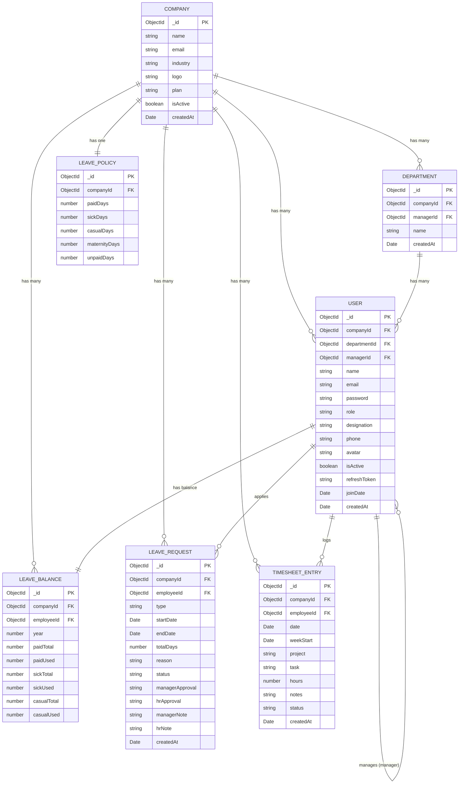

# Database Schema — Dia Desk

## Overview

Dia Desk is a **multi-tenant** HRM platform. Multiple companies can register independently. Each company has its own employees, departments, timesheets, leave policies, and data. One company cannot see another company's data.

Every collection (except `Company`) has a `companyId` field. This is how data is isolated per tenant.

---

## ER Diagram



---

## Collections

### Company
The top-level tenant. Everything belongs to a company.

| Field | Type | Description |
|---|---|---|
| `_id` | ObjectId | primary key |
| `name` | String | company name |
| `email` | String | company contact email (unique) |
| `industry` | String | e.g. "Technology", "Finance" |
| `logo` | String | url to logo image |
| `plan` | String | "FREE" \| "PRO" \| "ENTERPRISE" |
| `isActive` | Boolean | soft delete flag |
| `createdAt` | Date | auto |

---

### User (Employee)
Any person who belongs to a company. Role controls what they can access.

| Field | Type | Description |
|---|---|---|
| `_id` | ObjectId | primary key |
| `companyId` | ObjectId | which company they belong to |
| `departmentId` | ObjectId | which department they're in |
| `managerId` | ObjectId | their direct manager (self-referencing) |
| `name` | String | full name |
| `email` | String | unique per company |
| `password` | String | bcrypt hashed |
| `role` | String | `COMPANY_ADMIN` \| `HR_MANAGER` \| `MANAGER` \| `EMPLOYEE` |
| `designation` | String | job title |
| `phone` | String | optional |
| `avatar` | String | profile picture url |
| `isActive` | Boolean | deactivated employees stay in db |
| `refreshToken` | String | for jwt refresh flow |
| `joinDate` | Date | when they joined the company |

**Roles explained:**
- `COMPANY_ADMIN` — registered the company, full access
- `HR_MANAGER` — manages employees, approves leaves (second level)
- `MANAGER` — approves timesheets and leaves (first level) for their team
- `EMPLOYEE` — logs time, applies for leave, views own data

---

### Department
Belongs to a company. A user is assigned to one department.

| Field | Type | Description |
|---|---|---|
| `_id` | ObjectId | primary key |
| `companyId` | ObjectId | which company |
| `managerId` | ObjectId | who manages this department |
| `name` | String | e.g. "Engineering", "Sales" |

---

### LeavePolicy
One per company. Defines how many leave days each type gives per year.

| Field | Type | Description |
|---|---|---|
| `_id` | ObjectId | primary key |
| `companyId` | ObjectId | which company (unique) |
| `paidDays` | Number | default: 18 |
| `sickDays` | Number | default: 12 |
| `casualDays` | Number | default: 6 |
| `maternityDays` | Number | default: 180 |
| `unpaidDays` | Number | default: unlimited (999) |

---

### LeaveBalance
One per employee per year. Tracks used vs remaining days.

| Field | Type | Description |
|---|---|---|
| `_id` | ObjectId | primary key |
| `companyId` | ObjectId | which company |
| `employeeId` | ObjectId | which employee |
| `year` | Number | e.g. 2026 |
| `paidTotal` | Number | copied from LeavePolicy at start of year |
| `paidUsed` | Number | incremented on approval |
| `sickTotal` | Number | same |
| `sickUsed` | Number | same |
| `casualTotal` | Number | same |
| `casualUsed` | Number | same |

---

### LeaveRequest
One record per leave application.

| Field | Type | Description |
|---|---|---|
| `_id` | ObjectId | primary key |
| `companyId` | ObjectId | which company |
| `employeeId` | ObjectId | who applied |
| `type` | String | `PAID` \| `SICK` \| `CASUAL` \| `MATERNITY` \| `UNPAID` |
| `startDate` | Date | first day of leave |
| `endDate` | Date | last day of leave |
| `totalDays` | Number | working days between start and end |
| `reason` | String | employee's reason |
| `status` | String | `PENDING` \| `APPROVED` \| `REJECTED` \| `CANCELLED` |
| `managerApproval` | String | `APPROVED` \| `REJECTED` |
| `hrApproval` | String | `APPROVED` \| `REJECTED` |
| `managerNote` | String | optional comment from manager |
| `hrNote` | String | optional comment from HR |

**Approval flow:**
```
Employee applies → PENDING
Manager reviews → managerApproval = APPROVED/REJECTED
  if REJECTED → status = REJECTED (done)
  if APPROVED → HR reviews → hrApproval = APPROVED/REJECTED → status = final
```

---

### TimesheetEntry
One record per day per employee. Multiple entries can exist for one day (different projects).

| Field | Type | Description |
|---|---|---|
| `_id` | ObjectId | primary key |
| `companyId` | ObjectId | which company |
| `employeeId` | ObjectId | who logged it |
| `date` | Date | the specific day |
| `weekStart` | Date | Monday of that week (used to group weekly timesheets) |
| `project` | String | project name |
| `task` | String | what was done |
| `hours` | Number | 0.5 to 24 |
| `notes` | String | optional |
| `status` | String | `DRAFT` \| `SUBMITTED` \| `APPROVED` \| `REJECTED` |

**Status flow:**
```
Employee logs → DRAFT
Employee submits week → all DRAFTs become SUBMITTED
Manager reviews → APPROVED or REJECTED
```

---

## Multi-Tenancy Rules

1. Every query to any collection (except Company) must include `companyId` in the filter
2. The `companyId` is set server-side from the logged-in user's token — never from the request body
3. A user can only belong to one company
4. Company admins can invite users to their company
5. No cross-company data access is ever possible through the API
